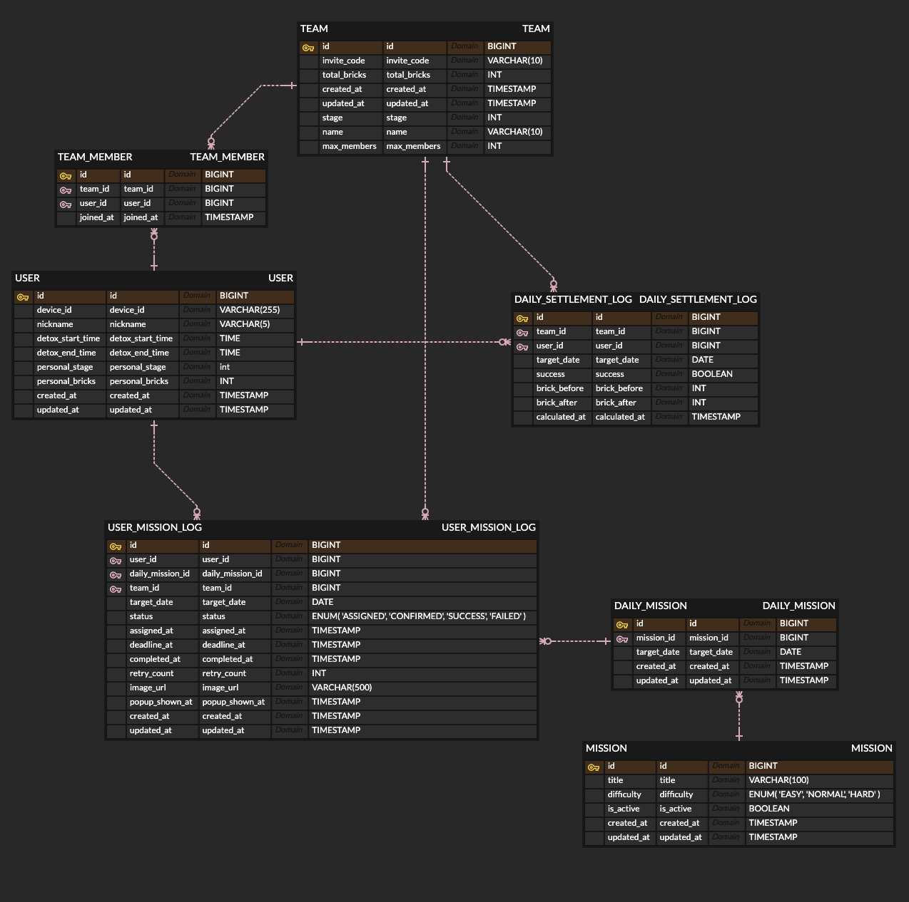

# 데이터베이스 설계 (ERD)

## 주요 엔티티
- **USER**: device_id(PK), nickname(max 5), email, email_notification_enabled, personal_bricks, team_id(선택된 팀)
- **TEAM**: id, name(max 10, unique), invite_code, max_members(4)
- **TEAM_MEMBER**: (중간 테이블) user_id, team_id
- **MISSION**: id, title, difficulty(EASY/NORMAL/HARD), is_active(boolean)
- **DAILY_MISSION**: id, mission_id(FK), target_date
- **USER_MISSION_LOG**: id, user_id, daily_mission_id(FK), team_id, target_date, status(ENUM), image_url
- **DAILY_SETTLEMENT_LOG**: id, team_id, user_id, target_date, success, brick_before, brick_after

## 관계 요약
- USER (N) : (M) TEAM => TEAM_MEMBER를 통해 다대다 매핑
- MISSION (1) : (N) DAILY_MISSION
- USER (1) : (N) USER_MISSION_LOG
- DAILY_MISSION (1) : (N) USER_MISSION_LOG